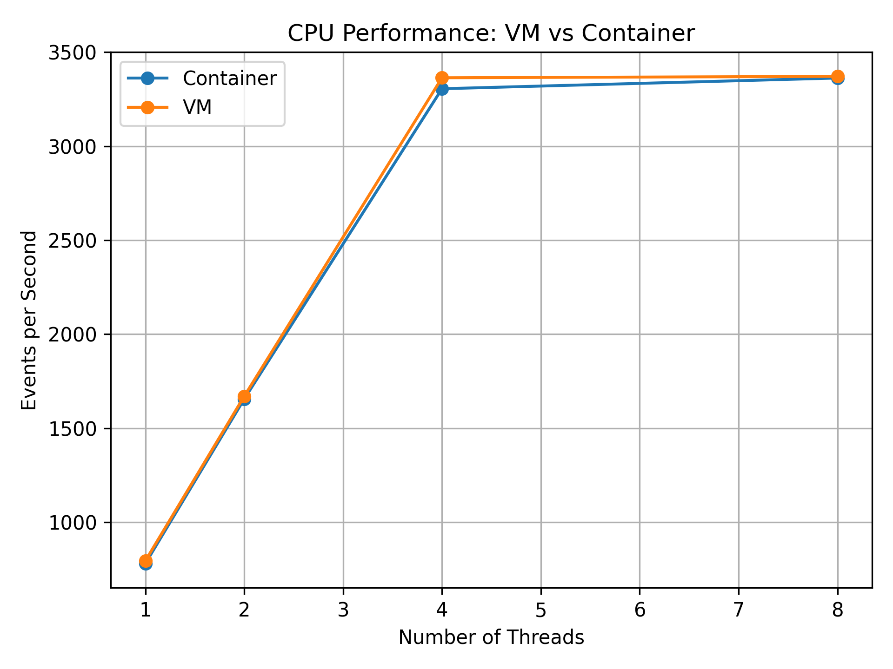
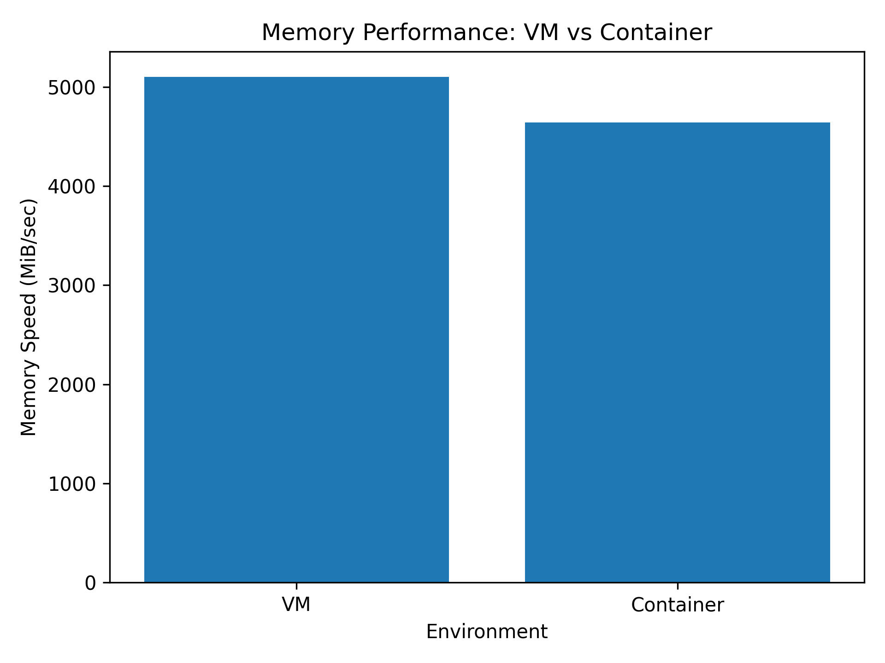
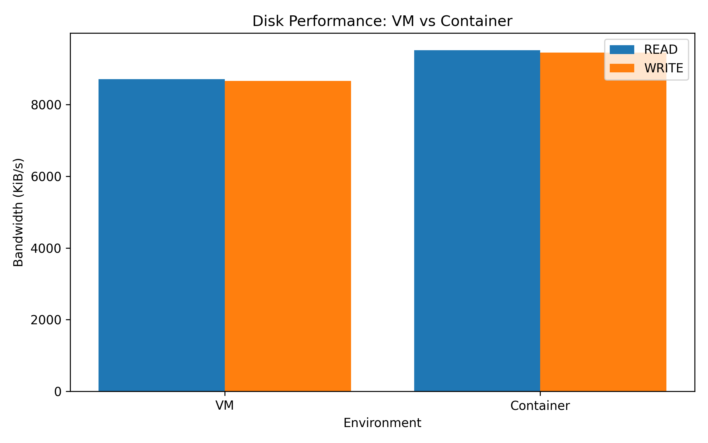
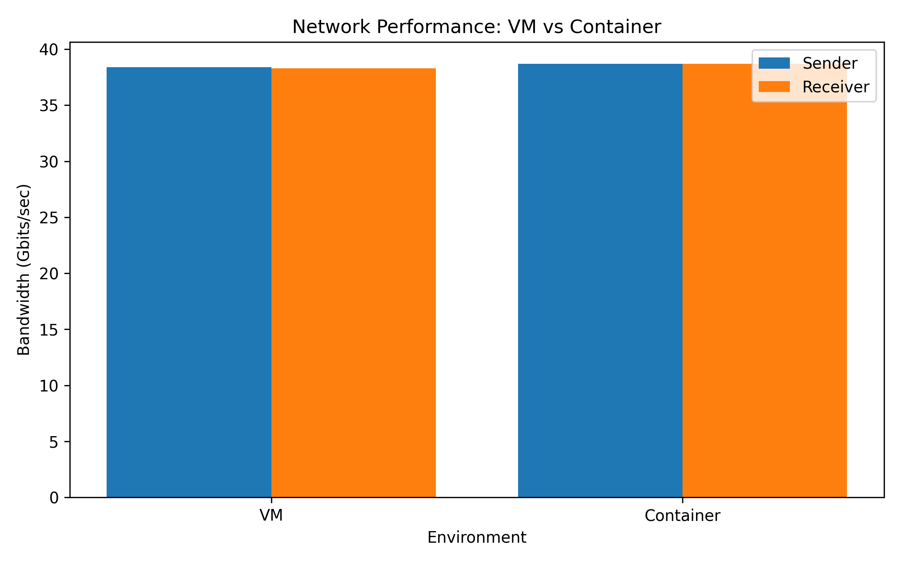

VM VS CONTAINER PERFORMANCE ANALYSIS

Comparative Performance Evaluation of Virtual Machines and Docker Containers


PROJECT OVERVIEW

This project presents an experimental performance comparison between a Virtual Machine and a Docker Container.

The evaluation covers four major workload categories:

| Workload | Benchmark Tool | Main Metric |
|---|---|---|
| CPU | Sysbench | Events/sec |
| Memory | Sysbench | MiB/sec |
| Disk I/O | FIO | KiB/sec |
| Network | iPerf3 | Gbits/sec |

The experiment includes environment setup, benchmark execution, raw data collection, result processing, CSV generation, graph generation, and comparative analysis.


AIM

To experimentally compare the performance of a Virtual Machine and a Docker Container across CPU, memory, disk I/O, and network workloads.


OBJECTIVES

| Objective |
|---|
| Configure the Virtual Machine environment |
| Configure the Docker Container environment |
| Collect system and environment information |
| Execute CPU benchmark workloads |
| Execute memory benchmark workloads |
| Execute disk I/O benchmark workloads |
| Execute network benchmark workloads |
| Store raw benchmark results |
| Process benchmark results into CSV files |
| Generate performance graphs |
| Compare VM and Container measurements |
| Document the complete experimental setup and results |


SYSTEM ARCHITECTURE

The experiment uses a host system containing a Virtual Machine and Docker-based Container environment.

```text
                         HOST SYSTEM
                              |
               +--------------+--------------+
               |                             |
               v                             v
       VMware Virtualization            Docker Engine
               |                             |
               v                             v
      +-------------------+          +-------------------+
      |   Virtual Machine |          | Docker Container  |
      |                   |          |                   |
      | Ubuntu Linux      |          | Linux Environment |
      |                   |          |                   |
      | CPU Workload      |          | CPU Workload      |
      | Memory Workload   |          | Memory Workload   |
      | Disk Workload     |          | Disk Workload     |
      | Network Workload  |          | Network Workload  |
      +---------+---------+          +---------+---------+
                |                              |
                +--------------+---------------+
                               |
                               v
                    Benchmark Measurements
                               |
                               v
                       Raw Result Files
                               |
                               v
                     Processed CSV Files
                               |
                               v
                       Python Analysis
                               |
                               v
                      Performance Graphs
                               |
                               v
                    VM vs Container Results
```


EXPERIMENTAL WORKFLOW

```text
System Information Collection
             |
             v
Virtual Machine Configuration
             |
             v
Docker Configuration
             |
             v
Benchmark Environment Preparation
             |
             +-------------------+-------------------+
             |                   |                   |
             v                   v                   v
            CPU               Memory               Disk
             |                   |                   |
             +-------------------+-------------------+
                                 |
                                 v
                              Network
                                 |
                                 v
                         Raw Measurements
                                 |
                                 v
                         Result Processing
                                 |
                                 v
                            CSV Files
                                 |
                                 v
                         Python Analysis
                                 |
                                 v
                       Graph Generation
                                 |
                                 v
                     Performance Comparison
```


EXPERIMENTAL SETUP

| Component | Configuration |
|---|---|
| Operating System | Ubuntu 22.04.5 LTS |
| Architecture | amd64 |
| Python Version | 3.10.12 |
| CPU Cores | 4 |
| Virtualization Platform | VMware |
| Container Platform | Docker |
| CPU Benchmark | Sysbench |
| Memory Benchmark | Sysbench |
| Disk Benchmark | FIO |
| Network Benchmark | iPerf3 |
| Data Processing | Python |
| Visualization | Matplotlib |
| Version Control | Git |
| Repository Hosting | GitHub |


SYSTEM INFORMATION COLLECTED

| Information | File |
|---|---|
| CPU Information | docs/cpu-info.txt |
| Docker Information | docs/docker-info.txt |
| Kernel Information | docs/kernel-info.txt |
| Memory Information | docs/memory-info.txt |
| Storage Information | docs/storage-info.txt |


BENCHMARK CONFIGURATION

CPU

| Parameter | Value |
|---|---|
| Benchmark | Sysbench CPU |
| Test Duration | 30 seconds |
| Threads | 1, 2, 4, 8 |
| Workload | Prime number calculation |
| Prime Limit | 20000 |
| Measurement | Events/sec |

Memory

| Parameter | Value |
|---|---|
| Benchmark | Sysbench Memory |
| Operation | Write |
| Threads | 1 |
| Block Size | 1 KiB |
| Total Size | 10 GiB |
| Measurement | MiB/sec |

Disk

| Parameter | Value |
|---|---|
| Benchmark | FIO |
| Operations | Read and Write |
| Measurement | KiB/sec |

Network

| Parameter | Value |
|---|---|
| Benchmark | iPerf3 |
| Protocol | TCP |
| Test Duration | 30 seconds |
| Test Address | 127.0.0.1 |
| Measurement | Gbits/sec |


WHAT WAS DONE

| Stage | Work Performed |
|---|---|
| 1 | Prepared the Virtual Machine environment |
| 2 | Prepared the Docker environment |
| 3 | Collected system information |
| 4 | Created CPU workload |
| 5 | Created memory workload |
| 6 | Created disk workload |
| 7 | Created network workload |
| 8 | Executed VM benchmarks |
| 9 | Executed Container benchmarks |
| 10 | Stored raw benchmark outputs |
| 11 | Processed benchmark outputs |
| 12 | Generated CSV files |
| 13 | Generated performance graphs |
| 14 | Compared VM and Container measurements |
| 15 | Organized the complete project repository |
| 16 | Documented the experimental results |


CPU PERFORMANCE

CPU performance was measured using Sysbench with multiple thread configurations.


CPU RESULTS

| Threads | VM | Container | Unit | Difference |
|---:|---:|---:|---|---:|
| 1 | 743.36 | 781.03 | Events/sec | 37.67 |
| 2 | 1670.49 | 1655.96 | Events/sec | 14.53 |
| 4 | 3364.15 | 3305.75 | Events/sec | 58.40 |
| 8 | 3371.46 | 3362.75 | Events/sec | 8.71 |


CPU OBSERVATIONS

- CPU measurements were relatively close between the VM and Container.
- The difference became small at higher thread counts.
- The 8-thread measurements were 3371.46 events/sec for the VM and 3362.75 events/sec for the Container.
- The benchmark was executed for different thread counts to observe scaling behavior.


CPU PERFORMANCE GRAPH




MEMORY PERFORMANCE

Memory performance was measured using Sysbench.


MEMORY RESULTS

| Environment | Throughput | Unit |
|---|---:|---|
| VM | 5102.12 | MiB/sec |
| Container | 4641.70 | MiB/sec |
| Difference | 460.42 | MiB/sec |


MEMORY OBSERVATIONS

- The VM measured 5102.12 MiB/sec.
- The Container measured 4641.70 MiB/sec.
- The measured memory throughput differed between the environments.
- The benchmark results represent the configured experimental environment.


MEMORY PERFORMANCE GRAPH




DISK I/O PERFORMANCE

Disk performance was evaluated using FIO for read and write operations.


DISK RESULTS

| Operation | VM | Container | Unit | Difference |
|---|---:|---:|---|---:|
| Read | 8709 | 9519 | KiB/sec | 810 |
| Write | 8663 | 9454 | KiB/sec | 791 |


DISK OBSERVATIONS

- VM read bandwidth was measured at 8709 KiB/sec.
- Container read bandwidth was measured at 9519 KiB/sec.
- VM write bandwidth was measured at 8663 KiB/sec.
- Container write bandwidth was measured at 9454 KiB/sec.
- Read and write measurements differed between the two environments.


DISK PERFORMANCE GRAPH




NETWORK PERFORMANCE

Network performance was measured using iPerf3.


NETWORK RESULTS

| Environment | Throughput | Unit |
|---|---:|---|
| VM | 38.7 | Gbits/sec |
| Container | 38.7 | Gbits/sec |
| Difference | 0 | Gbits/sec |


NETWORK OBSERVATIONS

- The VM measured 38.7 Gbits/sec.
- The Container measured 38.7 Gbits/sec.
- The measured network throughput was approximately equal.
- The network benchmark used a 30-second TCP test.


NETWORK PERFORMANCE GRAPH




OVERALL PERFORMANCE COMPARISON

| Performance Area | Metric | VM Result | Container Result | Difference | Observation |
|---|---|---:|---:|---:|---|
| CPU - 1 Thread | Events/sec | 743.36 | 781.03 | 37.67 | Close |
| CPU - 2 Threads | Events/sec | 1670.49 | 1655.96 | 14.53 | Close |
| CPU - 4 Threads | Events/sec | 3364.15 | 3305.75 | 58.40 | Close |
| CPU - 8 Threads | Events/sec | 3371.46 | 3362.75 | 8.71 | Very close |
| Memory | MiB/sec | 5102.12 | 4641.70 | 460.42 | Different |
| Disk Read | KiB/sec | 8709 | 9519 | 810 | Different |
| Disk Write | KiB/sec | 8663 | 9454 | 791 | Different |
| Network | Gbits/sec | 38.7 | 38.7 | 0 | Approximately equal |


CONSOLIDATED BENCHMARK RESULTS

| Category | VM | Container | Unit |
|---|---:|---:|---|
| CPU - 1 Thread | 743.36 | 781.03 | Events/sec |
| CPU - 2 Threads | 1670.49 | 1655.96 | Events/sec |
| CPU - 4 Threads | 3364.15 | 3305.75 | Events/sec |
| CPU - 8 Threads | 3371.46 | 3362.75 | Events/sec |
| Memory | 5102.12 | 4641.70 | MiB/sec |
| Disk Read | 8709 | 9519 | KiB/sec |
| Disk Write | 8663 | 9454 | KiB/sec |
| Network | 38.7 | 38.7 | Gbits/sec |


PERFORMANCE GRAPH COLLECTION

CPU Performance


Memory Performance


Disk Performance


Network Performance


GRAPH SUMMARY

| Graph | File | VM Measurement | Container Measurement | Metric |
|---|---|---|---|---|
| CPU | cpu_performance.png | 743.36–3371.46 | 781.03–3362.75 | Events/sec |
| Memory | memory_performance.png | 5102.12 | 4641.70 | MiB/sec |
| Disk | disk_performance.png | Read: 8709 / Write: 8663 | Read: 9519 / Write: 9454 | KiB/sec |
| Network | network_performance.png | 38.7 | 38.7 | Gbits/sec |


RAW RESULT ORGANIZATION

| Workload | VM Result | Container Result |
|---|---|---|
| CPU | results/raw/cpu/vm_cpu_results.txt | results/raw/cpu/docker_cpu_results.txt |
| Memory | results/raw/memory/vm_memory_results.txt | results/raw/memory/docker_memory_results.txt |
| Disk | results/raw/disk/vm_disk_results.txt | results/raw/disk/docker_disk_results.txt |
| Network | results/raw/network/vm_network_results.txt | results/raw/network/docker_network_results.txt |


PROCESSED RESULT ORGANIZATION

| Workload | Processed Result |
|---|---|
| CPU | results/processed/cpu_results.csv |
| Memory | results/processed/memory_results.csv |
| Disk | results/processed/disk_results.csv |
| Network | results/processed/network_results.csv |


ANALYSIS SCRIPTS

| Script | Purpose |
|---|---|
| scripts/analyze_cpu.py | Processes CPU benchmark results |
| scripts/analyze_memory.py | Processes memory benchmark results |
| scripts/analyze_disk.py | Processes disk benchmark results |
| scripts/analyze_network.py | Processes network benchmark results |


PROJECT DIRECTORY STRUCTURE

```text
CC_VM_vs_Container_Performance/
|
|-- README.md
|-- .gitignore
|
|-- docker/
|   |-- Dockerfile
|
|-- docs/
|   |-- cpu-info.txt
|   |-- docker-info.txt
|   |-- kernel-info.txt
|   |-- memory-info.txt
|   |-- storage-info.txt
|
|-- results/
|   |
|   |-- figures/
|   |   |-- cpu_performance.png
|   |   |-- memory_performance.png
|   |   |-- disk_performance.png
|   |   |-- network_performance.png
|   |
|   |-- processed/
|   |   |-- cpu_results.csv
|   |   |-- memory_results.csv
|   |   |-- disk_results.csv
|   |   |-- network_results.csv
|   |
|   |-- raw/
|       |
|       |-- cpu/
|       |   |-- vm_cpu_results.txt
|       |   |-- docker_cpu_results.txt
|       |
|       |-- memory/
|       |   |-- vm_memory_results.txt
|       |   |-- docker_memory_results.txt
|       |
|       |-- disk/
|       |   |-- vm_disk_results.txt
|       |   |-- docker_disk_results.txt
|       |
|       |-- network/
|           |-- vm_network_results.txt
|           |-- docker_network_results.txt
|
|-- scripts/
|   |-- analyze_cpu.py
|   |-- analyze_memory.py
|   |-- analyze_disk.py
|   |-- analyze_network.py
|
|-- vm/
|
|-- api/
|
|-- workloads/
    |
    |-- cpu/
    |-- memory/
    |-- disk/
    |-- network/
```


TECHNOLOGIES USED

| Technology | Purpose |
|---|---|
| Ubuntu | Operating system |
| VMware | Virtual Machine environment |
| Docker | Container environment |
| Sysbench | CPU and memory benchmarking |
| FIO | Disk I/O benchmarking |
| iPerf3 | Network benchmarking |
| Python | Data processing |
| Pandas | CSV processing |
| Matplotlib | Graph generation |
| Git | Version control |
| GitHub | Repository hosting |


FINAL RESULT

| Area | Experimental Result |
|---|---|
| CPU | VM and Container produced relatively close measurements |
| Memory | Different throughput measurements were obtained |
| Disk Read | Different bandwidth measurements were obtained |
| Disk Write | Different bandwidth measurements were obtained |
| Network | Both environments measured 38.7 Gbits/sec |
| Graphs | Four performance graphs were generated |
| Raw Data | Benchmark outputs were stored separately for VM and Container |
| Processed Data | Results were converted into CSV files |
| Analysis | Python scripts were used for processing and visualization |
| Comparison | VM and Container measurements were compared across four workload categories |


KEY OBSERVATIONS

- CPU measurements were relatively close between the VM and Container.
- CPU measurements were especially close at higher thread counts.
- Memory throughput measurements differed between the two environments.
- Disk read measurements differed between the two environments.
- Disk write measurements differed between the two environments.
- Network throughput was approximately equal at 38.7 Gbits/sec.
- Raw benchmark outputs were retained for reference.
- Processed CSV files were generated for analysis.
- Four graphs were generated for visual comparison.
- The complete benchmark results are specific to the experimental configuration.


CONCLUSION

| Category | Conclusion |
|---|---|
| CPU | Relatively close measurements were obtained |
| Memory | Different measured throughput was observed |
| Disk | Different measured read and write bandwidth was observed |
| Network | Approximately equal throughput was measured |
| Data Processing | Raw results were converted into processed CSV data |
| Visualization | CPU, memory, disk, and network graphs were generated |
| Comparative Analysis | VM and Container measurements were evaluated across multiple workloads |
| Experimental Scope | Results apply to the tested hardware and configuration |


AUTHOR

Sunayana Kamat
